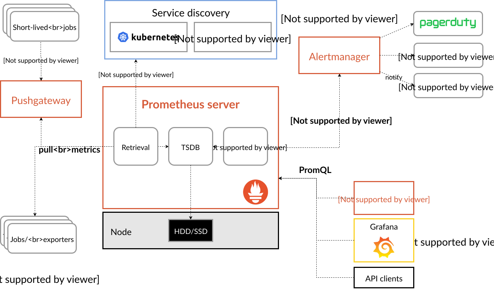

# Prometheus

Top level architecture




Use case - recording any purely numeric time series

## Data model

Prometheus stores data as time series: streams of timestamped values belonging to the same metric and the same set of labeled dimensions. Besides stored time series, Prometheus may generate temporary derived time series as the result of queries.

```
api_http_requests_total{method="POST", handler="/messages"}
```
`api_http_requests_total` - metric
`method="POST"`, `handler="/messages"`- labels

## Metric types

### Counter 

Cumulative metric that represents a single monotonically increasing counter whose value can only increase or be reset to zero on restart.

For example, you can use a counter to represent the number of requests served, tasks completed, or errors.

### Gauge

A gauge is a metric that represents a single numerical value that can arbitrarily go up and down.

Gauges are typically used for measured values like temperatures or current memory usage, but also "counts" that can go up and down, like the number of concurrent requests.

### Histogram

A histogram samples observations (usually things like request durations or response sizes) and counts them in configurable buckets. It also provides a sum of all observed values.

### Summary

Similar to a histogram, a summary samples observations (usually things like request durations and response sizes). While it also provides a total count of observations and a sum of all observed values, it calculates configurable quantiles over a sliding time window.


## Jobs and instances

In Prometheus terms, an endpoint you can scrape is called an instance, usually corresponding to a single process. A collection of instances with the same purpose, a process replicated for scalability or reliability for example, is called a job.


## Storage

Prometheus includes a local on-disk time series database, but also optionally integrates with remote storage systems.

Prometheus's local time series database stores data in a custom, highly efficient format on local storage.

Note that a limitation of local storage is that it is not clustered or replicated. Thus, it is not arbitrarily scalable or durable in the face of drive or node outages and should be managed like any other single node database.

### On-disk layout

Ingested samples are grouped into blocks of two hours. Each two-hour block consists of a directory containing a chunks subdirectory containing all the time series samples for that window of time, a metadata file, and an index file (which indexes metric names and labels to time series in the chunks directory). The samples in the chunks directory are grouped together into one or more segment files of up to 512MB each by default. When series are deleted via the API, deletion records are stored in separate tombstone files (instead of deleting the data immediately from the chunk segments).

The current block for incoming samples is kept in memory and is not fully persisted. It is secured against crashes by a write-ahead log (WAL) that can be replayed when the Prometheus server restarts. Write-ahead log files are stored in the wal directory in 128MB segments. These files contain raw data that has not yet been compacted; thus they are significantly larger than regular block files. Prometheus will retain a minimum of three write-ahead log files. High-traffic servers may retain more than three WAL files in order to keep at least two hours of raw data.